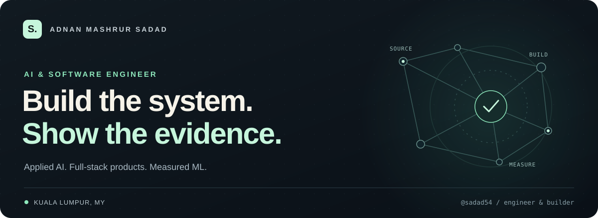
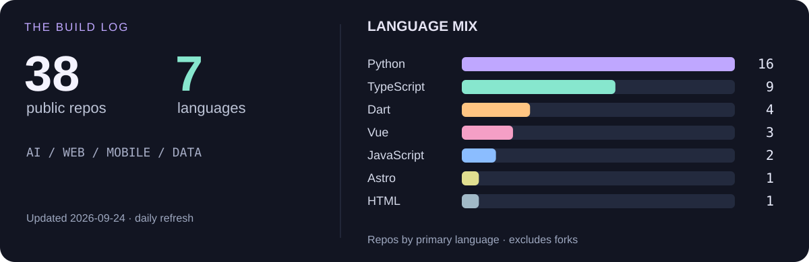
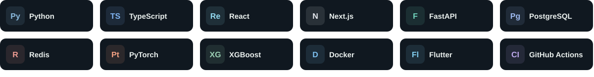

  

  <strong>Adnan Mashrur Sadad · AI & Software Engineer · Kuala Lumpur 🇲🇾</strong> 
  Usually somewhere between a model, an API, and “one last UI tweak.”

  <a href="mailto:adnanmashrursadad@gmail.com">Say hello ↗</a> &nbsp; · &nbsp;
  <a href="https://www.linkedin.com/in/adnan-mashrur-sadad-87a45b237">LinkedIn</a> &nbsp; · &nbsp;
  <a href="https://github.com/sadad54?tab=repositories">Explore my repos</a>

### 📊 The GitHub corner

Numbers, minus the graphics

<!-- STATS:START -->
Updated **2026-09-24** · **38 public repositories** · **7 primary languages**.

| Primary language | Repositories |
| :--- | ---: |
| Python | 16 |
| TypeScript | 9 |
| Dart | 4 |
| Vue | 3 |
| JavaScript | 2 |
| Astro | 1 |
| HTML | 1 |

Language counts exclude forks and repos with no detected language. These are repository counts, not code volume or proficiency scores.
<!-- STATS:END -->

### 🕹️ Pick a project

<table>
<tr>
<td width="50%" valign="top">

**🧠 [ProofHire](https://github.com/sadad54/ResumeGitProject)**  
Your code → evidence → a better application. AI with receipts.

`Next.js` `FastAPI` `pgvector`

</td>
<td width="50%" valign="top">

**🌊 [Driftline](https://github.com/sadad54/driftline)**  
Fraud detection meets model drift. **590K+ historical transactions** in the replay dataset.

`XGBoost` `Kafka API` `MLflow`

</td>
</tr>
<tr>
<td width="50%" valign="top">

**🔬 [SAFE-RAG](https://github.com/sadad54/SAFE-RAG)**  
A citation isn't a free pass. Researching where grounded-looking answers go wrong.

`Python` `RAG` `Evaluation`

</td>
<td width="50%" valign="top">

**🎙️ [InterviewPilot](https://github.com/sadad54/interviewpilot)**  
Practice interviews that ask the next question, not just the first.

`React` `FastAPI` `Groq`

</td>
</tr>
</table>

**Side quests:** [⚽ Football simulations](https://github.com/sadad54/worldcup_predictor) · [🧾 Receipt OCR](https://github.com/sadad54/expensense) · [🔎 Financial research](https://github.com/sadad54/finscout)

### 🧰 The loadout

A little background + résumés

Software Engineering at **MJIIT, UTM** · Former developer intern at **Joget** · **myHCI-UX 2025 Gold Medal + Best Video**.

Open to **SWE, AI, and ML engineering opportunities**.

[AI / ML résumé](https://github.com/sadad54/ProjectOrganisation/blob/main/portfolio-next/public/Adnan_Sadad_AI_ML_Resume_LaTeX.pdf) · [SWE résumé](https://github.com/sadad54/ProjectOrganisation/blob/main/portfolio-next/public/Adnan_Sadad_SWE_Resume_LaTeX.pdf)

Build something useful. Make it feel good to use. Find out where it breaks. Repeat. ✦

